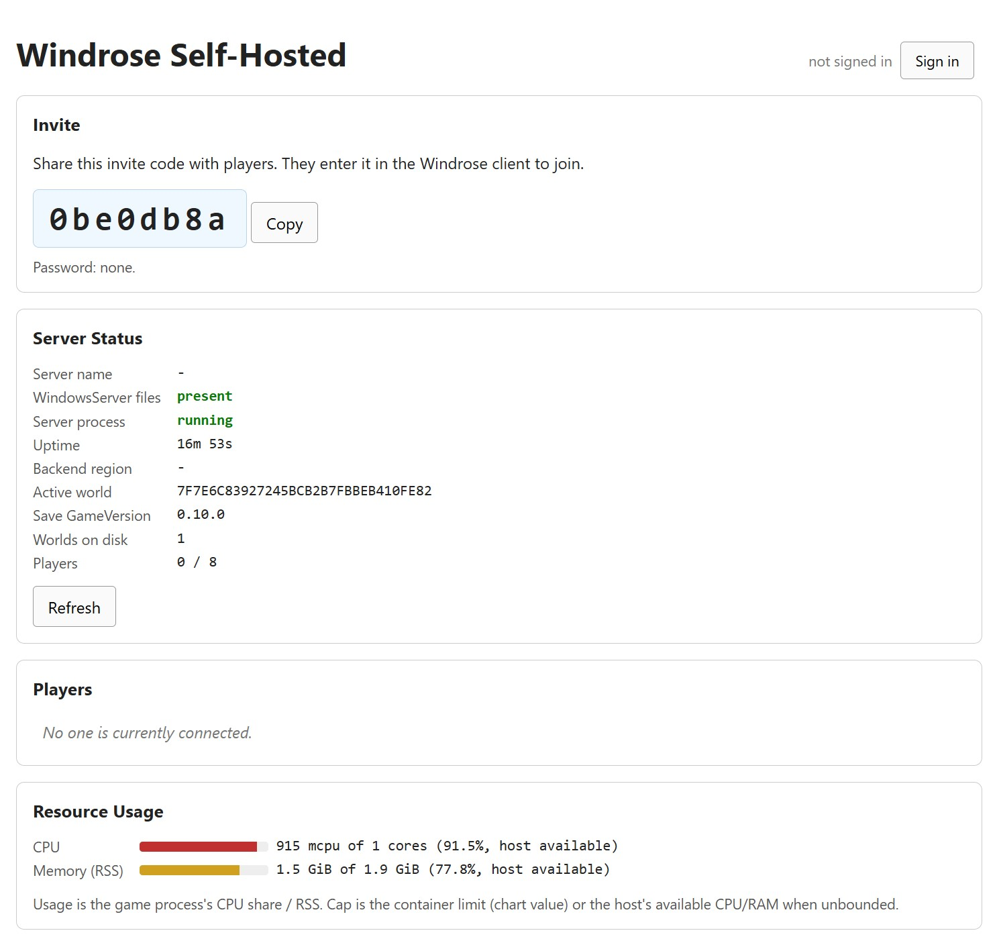
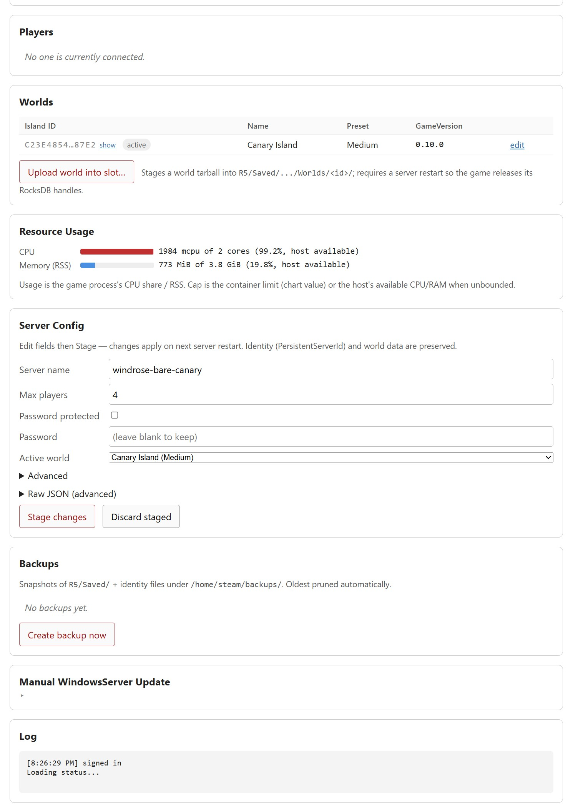

# How To Install A Windrose Self-Hosted Server

Open-source deployment bundle for running a Windrose dedicated server on Kubernetes or with Docker Compose. Runs the Windows-only dedicated server binary under Proton.

This is a community project. It is not affiliated with or endorsed by the Windrose developers. The only hosting Windrose officially supports is Nitrado — see the [Windrose FAQ](https://playwindrose.com/faq/).

## What Makes This Different

The Windrose dedicated-server Steam app (id `4129620`) pulls fine via anonymous SteamCMD — that's the default bootstrap, so a fresh pod / droplet / compose stack goes from nothing to a running server without any WindowsServer tarball work. Save data lives on persistent storage and survives game patches automatically. The admin console also exposes an upload path for operators running a pre-release or modded `WindowsServer/` build; see *Optional: Bring Your Own Server Files* below.

The pod runs three containers:

- **`windrose`** — the game itself under GE-Proton. Only runs the game binary; no backgrounded work in its shell (Proton hates shell job-control races with Xvfb).
- **`xvfb`** — a dedicated X display server on `:99`, shared into the game container via an `emptyDir` at `/tmp/.X11-unix`. Lives in its own container so its signal space can't interfere with Proton.
- **`windrose-ui`** — a stdlib-only Python admin console (served from the same image as the game container via `python3 /opt/windrose-ui/server.py`). Exposes the invite-code card, server/players/resources status, config editor, backups, per-world editor, manual `WindowsServer` upload, and Discord/generic webhook dispatch. Shares the PVC with the game container so both see the same filesystem.

All three share the pod's PID namespace (`shareProcessNamespace: true`) so the UI sidecar can `pgrep` for the game process.

Other Windrose dockerizations exist — this one leans on patterns we already operate in [`enshrouded-self-hosted`](https://github.com/shipstuff/enshrouded-self-hosted): GE-Proton, non-root container, PVC-backed persistence, host networking, Helm + plain manifests + Docker Compose in sync.

## Choose An Install Path

- **[Kubernetes / Helm](helm/windrose/README.md)** — primary path. `helm upgrade --install windrose ./helm/windrose -n games --create-namespace`. Full override + Secret + config-mode guide in the chart's README.
- **Kubernetes / plain manifests**: `kubectl apply -k .` — renders the same StatefulSet + PVC + Service + Ingress as the chart. See below.
- **[Docker Compose](docker-compose.yaml)**: `docker compose up -d`. Env overrides via a sibling `.env` file.
- **[Bare Linux (systemd)](bare-linux/README.md)** — `sudo ./bare-linux/install.sh`. Three system services running as non-root `steam`, UI on loopback by default.

## Admin UI

The admin console is a stdlib-only Python HTTP server baked into the same container as the game. It handles the invite-code display, server/players/resource status, config editor with staged-changes diffing, per-world editor, backups, manual `WindowsServer` upload, and Discord/generic webhook dispatch. Authentication is optional HTTP basic auth (`UI_PASSWORD`); destructive routes are gated behind that password plus an `UI_ENABLE_ADMIN_WITHOUT_PASSWORD` opt-in for LAN-only deploys.

Public view (not signed in) — invite code, server status, connected players, resource usage. Everything read-only, no admin surface exposed:



Admin view (signed in) — adds the Worlds card with per-row editor, Server Config with stage/apply/discard, Backups, Manual WindowsServer update, and the live log tail:




## Published Images And Helm Chart

- `ghcr.io/shipstuff/windrose-server` — single image for game + xvfb + UI sidecar (stdlib Python admin console baked in at `/opt/windrose-ui/`)
- `oci://ghcr.io/shipstuff/charts/windrose` — Helm chart

## Critical Setting: `P2pProxyAddress`

The single knob operators most need to understand. The dedicated server advertises this value verbatim to Windrose's backend as its ICE **host candidate** — the address clients attempt to connect to. If it is `0.0.0.0`, the Windows client rejects it (`WSAEFAULT 1214`), the UE P2P consent-check times out after ~10 s, and players **silently bounce back to the main menu with no error**.

**Default behavior: auto-detect.** When `P2P_PROXY_ADDRESS` is unset (or `0.0.0.0`), the entrypoint opens a `SOCK_DGRAM` socket, `connect()`s it to `8.8.8.8:53` (no packets sent), and reads back `getsockname()` — the kernel's answer to "what source IP would I use to reach the internet from this host." Under `hostNetwork: true` that's the LAN/WAN-facing interface, which is exactly what we want to advertise. Works the same in k8s, compose, bare-Linux — no Downward API needed, no interface enumeration, no iproute2 dependency.

**When to override** (`serverConfig.p2pProxyAddress` in Helm, `P2P_PROXY_ADDRESS` in compose, env var on bare-Linux):

- Multi-homed hosts where the default-route interface isn't the one you want clients to hit.
- WAN-first deployments where you'd rather advertise the public IP than the LAN IP (most operators don't need this — ICE's srflx candidate handles WAN via STUN automatically).
- Air-gapped environments where `8.8.8.8:53` isn't reachable and auto-detect falls back to `0.0.0.0`.

## Server Binaries

On first boot the container runs anonymous SteamCMD against app id `4129620` and pulls `WindowsServer/` (~3 GiB) straight onto the PVC / local volume. The game launches as soon as the pull completes. Subsequent restarts are quick: SteamCMD re-checks for updates in seconds. That's the default (`serverConfig.source: steamcmd` in Helm, `WINDROSE_SERVER_SOURCE=steamcmd` in compose / bare-Linux) — no operator action required.

### Optional: Bring Your Own Server Files

If you need to run a pre-release, modded, or pinned `WindowsServer/` build instead of whatever SteamCMD serves today, flip `serverConfig.source: files` (k8s) / `WINDROSE_SERVER_SOURCE=files` (compose / bare-Linux) and upload the tarball through the admin console. The server waits for the files to appear before launching.

Pack from your workstation's Steam install (the folder lives at `<Steam library>/steamapps/common/Windrose/R5/Builds/WindowsServer/`):

**Windows (PowerShell — `tar.exe` ships with Windows 10+):**
```powershell
$src = 'C:\Program Files (x86)\Steam\steamapps\common\Windrose\R5\Builds'
tar.exe -czf "$HOME\windrose-server.tgz" -C $src WindowsServer
```

**WSL / Linux (helper script auto-locates via `libraryfolders.vdf`):**
```bash
bash scripts/pack-windowsserver.sh ~/windrose-server.tgz
```

Then drop the tarball into the admin console's **Manual WindowsServer Update** card, or POST it directly:

```bash
curl --fail --data-binary @~/windrose-server.tgz \
  -H 'Content-Type: application/octet-stream' \
  -H 'X-Filename: windrose-server.tgz' \
  -u admin:$PASSWORD \
  http://<host>/api/upload
```

For LAN k8s, `kubectl cp` is faster than a round-trip through the Ingress:

```bash
kubectl -n games cp "<path>/WindowsServer" windrose-0:/home/steam/windrose/WindowsServer -c windrose-ui
```

Uploads preserve `R5/Saved/`, `ServerDescription.json`, and `WorldDescription.json`; a timestamped snapshot of the previous tree lands in `/home/steam/backups/<utc>/`.

## Install On Kubernetes With Helm

```bash
helm upgrade --install windrose ./helm/windrose \
  --namespace games --create-namespace
```

See [`helm/windrose/README.md`](helm/windrose/README.md) for typical
overrides, password-protection via Secret, the three
`serverConfig.mode` behaviors (`env` / `managed` / `mutable`),
webhook wiring, and the game-patch update flow.

## Install On Kubernetes With Plain Manifests Or Kustomize

```bash
kubectl apply -k .
```

Renders the same StatefulSet + PVC + Service + Ingress as the Helm
chart. Edit `statefulset.yaml`'s `nodeSelector` to match your node
(or drop it for network storage). Hostname defaults to
`windrose.local` on the Ingress. Port-forward without Ingress:
`kubectl -n games port-forward svc/windrose 28080:28080`.

## Install With Docker Compose

```bash
docker compose up -d
```

Or build locally: `docker compose up -d --build`.

Override runtime env vars via a sibling `.env` file — common ones are
`SERVER_NAME`, `MAX_PLAYER_COUNT`, `P2P_PROXY_ADDRESS` (only if
auto-detect picks the wrong interface), `UI_BIND` / `UI_PASSWORD` to
expose the admin console. See [`docker-compose.yaml`](docker-compose.yaml)
for the full env list; it's commented inline.

All three containers come up: `windrose` (game, `network_mode: host`), `xvfb` (display server), `windrose-ui` (UI on `127.0.0.1:28080` by default).

## Install On Bare Linux

```bash
sudo ./bare-linux/install.sh
```

Three systemd system services (game + Xvfb + admin UI), running as a
non-root `steam` user. UI binds to `127.0.0.1` by default; override
with `UI_BIND=0.0.0.0 UI_PASSWORD=…` at install time. See
[`bare-linux/README.md`](bare-linux/README.md) for sizing, swap recipe,
and the pre-loaded-world workflow (recommended for small VPSes).

## Configure Server Runtime

The server config lives at `/home/steam/windrose/WindowsServer/R5/ServerDescription.json`. In `env` mode the entrypoint patches known keys from env on every start.

Every variable below is consumed by the container entrypoint, so it applies identically across Helm (via `values.yaml`), plain manifests / compose (via the container env), and bare-Linux (via `/etc/windrose/windrose.env` written by `install.sh`). See [`helm/windrose/README.md`](helm/windrose/README.md#values-reference) for the full Helm-values table (which wraps these and adds chart-level knobs like `resources`, `ingress`, `blackholeRegions`).

**Server identity + world**
| Env var | Default | Purpose |
|---|---|---|
| `SERVER_NAME` | `Windrose Server` | Informational |
| `INVITE_CODE` | generated | Six-plus character alphanumeric code. Backend mints one if unset. |
| `IS_PASSWORD_PROTECTED` | `false` | Toggle password gate |
| `SERVER_PASSWORD` | `` | Password when `IS_PASSWORD_PROTECTED=true` |
| `MAX_PLAYER_COUNT` | `4` | 4 per official guide; up to 10 with more RAM |
| `WORLD_ISLAND_ID` | `default-world` | Matches folder under `Saved/.../RocksDB/<GameVersion>/Worlds/`. See caveat — backend assigns the real ID. |
| `WORLD_NAME` | `Default Windrose World` | Display name |
| `WORLD_PRESET_TYPE` | `Medium` | `Easy`, `Medium`, `Hard`, `Custom` |
| `P2P_PROXY_ADDRESS` | auto-detected (UDP-connect getsockname trick; falls back to `0.0.0.0` if the trick fails) | The ICE host candidate advertised to clients. Override only if auto-detect picks the wrong interface. |

**Direct IP Connection** (Windrose 2026-04+). Alternative to the backend connectivity service — players join via a raw IP:port instead of an invite code. Leave `USE_DIRECT_CONNECTION` empty (the default) unless your ISP blocks Windrose's backend. Enabling disables invite codes, advertises the address to connecting clients, and **requires you to manually port-forward UDP on your router**.

| Env var | Default | Purpose |
|---|---|---|
| `USE_DIRECT_CONNECTION` | empty (feature off) | Set `true` to opt in, `false` to opt out. Empty leaves the field alone on existing configs. |
| `DIRECT_CONNECTION_SERVER_ADDRESS` | reuses `P2P_PROXY_ADDRESS` when empty | The IP clients connect to. Can be a LAN IP (LAN-only play) or your public IP (router port-forwarding). |
| `DIRECT_CONNECTION_SERVER_PORT` | `7777` | UDP port you forwarded on the router. |
| `DIRECT_CONNECTION_PROXY_ADDRESS` | `0.0.0.0` | Only override if you're fronting with an explicit proxy. |

**Runtime behavior**
| Env var | Default | Purpose |
|---|---|---|
| `WINDROSE_CONFIG_MODE` | `env` | `env` (stamp `ServerDescription.json` from env on every boot), `managed` (render from chart inlineJson + Secret), `mutable` (leave operator's on-disk file alone; recommended for UI-driven edits). |
| `WINDROSE_LAUNCH_STRATEGY` | `shipping` | `shipping` (headless, recommended) or `launcher` (`WindroseServer.exe`). |
| `WINDROSE_SERVER_SOURCE` | `steamcmd` | `steamcmd` (anonymous `app_update 4129620` on every boot) or `files` (operator populates `WindowsServer/` via UI upload / `kubectl cp`). |
| `SERVER_LAUNCH_ARGS` | `-FPS=60` | Extra args appended after `-log` on the game binary's command line. Caps the game's main loop; pair with `NET_SERVER_MAX_TICK_RATE` below to keep command-line + Engine.ini in sync. Empty uncaps. |
| `NET_SERVER_MAX_TICK_RATE` | `60` | Server-side tick rate (`stat srvfps`) — stamped into Engine.ini's `NetServerMaxTickRate` + `t.MaxFPS` on every boot. **This is the knob that moves the needle** — `SERVER_LAUNCH_ARGS=-FPS=N` alone doesn't change the net tick, only the render cap. Lower to `30` on constrained hosts (1-2 vCPU VPSes, older NAS) to halve per-tick CPU + replication bandwidth at the cost of visibly choppier movement. Raise to `120` on real hardware with LAN/low-latency clients. Uses shadow-stamp: hand-edits to Engine.ini for these two keys survive subsequent helm upgrades (we only overwrite when the on-disk value matches the one we last wrote). |
| `FILES_WAIT_TIMEOUT_SECONDS` | `0` | 0 = wait forever for `WindowsServer/` to appear before launching. Only relevant when `WINDROSE_SERVER_SOURCE=files`. |
| `PROTON_USE_XALIA` | `0` | Xalia crashes on headless Proton; leave off. |
| `DISABLE_SENTRY` | `1` | Crashpad hard-aborts under Wine; keep Sentry disabled unless you're debugging. |

**Idle-CPU patch**
| Env var | Default | Purpose |
|---|---|---|
| `WINDROSE_PATCH_IDLE_CPU` | `0` | `1` → entrypoint builds a `WindroseServer-Win64-Shipping.patched.exe` sibling of the Steam-managed original on every start (caching by source md5), and launches that instead. The original is never modified, so SteamCMD's app_update has nothing to revert. **Experimental, no warranty** — see Caveats and the script header. Bare-Linux `install.sh` prompts for confirmation when flipping to `1`; set `WINDROSE_PATCH_ACK_RISK=1` to bypass for headless operators. |
| `WINDROSE_PATCH_OVERRIDE_FILE` | `$R5_DIR/.idle-patch-override` | Runtime override written by the admin UI's Idle-CPU card. `disabled` forces OFF (patched sibling is removed on next restart, game launches original); `enabled` forces ON regardless of env. Absent = follow `WINDROSE_PATCH_IDLE_CPU`. |

**Admin UI (`windrose-ui` sidecar)**
| Env var | Default | Purpose |
|---|---|---|
| `UI_BIND` | `127.0.0.1` (compose / bare-Linux) / `0.0.0.0` (k8s) | UI httpd bind address. Flip to `0.0.0.0` + set `UI_PASSWORD` to expose outside loopback. |
| `UI_PORT` | `28080` | UI httpd port. |
| `UI_PASSWORD` | `` | HTTP basic-auth password; empty = no auth (only safe on LAN-only / firewalled hosts). Username is ignored. |
| `UI_ENABLE_ADMIN_WITHOUT_PASSWORD` | `false` | Explicit opt-in for destructive endpoints when `UI_PASSWORD` is empty. With a password set, destructive is always allowed. |
| `UI_SERVE_STATIC` | `true` | Set `false` to have the Python sidecar serve only `/api/*`; pair with an nginx that owns the static bundle. |

**Backups**
| Env var | Default | Purpose |
|---|---|---|
| `WINDROSE_BACKUP_ROOT` | `/home/steam/backups` | Where `create_backup()` drops timestamped snapshots. |
| `WINDROSE_BACKUP_RETAIN` | `10` | Minimum count of most-recent non-pinned backups to keep. Combined with the age window below via OR — a backup survives if either rule keeps it. Acts as a hard floor: even if no new backups happen for a year, the newest N survive. |
| `WINDROSE_BACKUP_RETAIN_DAYS` | `7` | Keep anything younger than this many days, regardless of count. Age rule only **adds** to the keep set — never subtracts — so if the auto-backup scheduler stalls, the most-recent N from the count rule still stick around. |
| `WINDROSE_AUTO_BACKUP_IDLE_MINUTES` | `1` | Idle trigger: take an auto-backup N minutes after the last player disconnects. Set `0` to disable. |
| `WINDROSE_AUTO_BACKUP_FLOOR_HOURS` | `6` | Floor trigger: if the server has been continuously active (players connected) for M hours with no auto-backup, take one. Set `0` to disable. |
| `WINDROSE_ALLOW_FRESH_WORLD` | `0` | Escape hatch for the entrypoint's "Saved/ is empty but this install used to have a world" data-loss guard. Set `1` only when you genuinely want to start fresh on an install that previously had saves. Usually you want to restore from a backup instead. |

**Runtime override.** Once an operator edits the auto-backup schedule in the admin UI, the values are persisted atomically to `$R5_DIR/.backup-config.json` and **the file is authoritative thereafter** — the env vars above only seed the initial values until the file exists. Delete the file to fall back to env-driven defaults.

**Manual vs auto.** Two independent systems, like in-game manual saves vs auto-saves. Clicking *Create backup now* does **not** reset either auto-backup clock. Pinned backups (dirs whose name starts with `manual-`) are exempt from retention and never auto-pruned. Create one via `POST /api/backups` with body `{"pin": true}`, or pin an existing one via `POST /api/backups/{id}/pin`. Auto-created backups land in unprefixed timestamped dirs with a hidden `.auto` marker file inside — the admin UI tags their rows accordingly and webhook payloads include `source: "auto"`.

**Webhooks (fires from a background poller)**
| Env var | Default | Purpose |
|---|---|---|
| `WINDROSE_WEBHOOK_URL` | `` | Generic JSON `POST` target. |
| `WINDROSE_DISCORD_WEBHOOK_URL` | `` | Discord embed target. |
| `WINDROSE_WEBHOOK_EVENTS` | `server.online,server.offline,player.join,player.leave` | Comma-separated subset. Additional events: `backup.created`, `backup.restored`, `config.applied`. |
| `WINDROSE_WEBHOOK_POLL_SECONDS` | `15` | Poll cadence for the event detector thread. |
| `WINDROSE_WEBHOOK_TIMEOUT` | `5` | HTTP POST timeout (seconds). |

## Update The Server On Game Patch

When Windrose ships a patch, the dedicated-server binary bumps its `<GameVersion>` save-path segment. Entrypoint migrates worlds forward automatically when it sees ≥2 version folders under `RocksDB/`.

### Preferred: re-upload via the UI (or its [API](#admin-console-api))

The UI's upload endpoint (`/api/upload`) preserves the save, `ServerDescription.json` (the server's **identity** — PersistentServerId, WorldIslandId, InviteCode), and `WorldDescription.json` across replacement, and snapshots the old tree to `/home/steam/backups/<utc>/` (last 5 kept). This is the only flow that keeps your save tied to your old island; a bare wipe orphans it (see caveat below).

**Via the UI:**

1. Update Windrose via Steam on your workstation.
2. Pack the new `WindowsServer/`:
   ```bash
   tar -czf ~/windrose-server.tgz \
     -C "/mnt/c/Program Files (x86)/Steam/steamapps/common/Windrose/R5/Builds" \
     WindowsServer
   ```
3. Open `http://windrose.local`, drop the tarball into the Upload form, click **Upload update**.
4. Restart the game container to load the new binary:
   - k8s: `kubectl -n games delete pod windrose-0`
   - compose: `docker compose restart windrose`
5. On next boot the entrypoint detects the new `<GameVersion>` folder and migrates worlds forward. Backend sees your preserved PSID and hands back the same island.

**Via curl (same endpoint, scriptable):**

```bash
tar -czf ~/windrose-server.tgz \
  -C "/mnt/c/Program Files (x86)/Steam/steamapps/common/Windrose/R5/Builds" \
  WindowsServer

curl --fail --data-binary @~/windrose-server.tgz \
  -H 'Content-Type: application/octet-stream' \
  -H 'X-Filename: windrose-server.tgz' \
  http://windrose.local/api/upload

# Then restart the game container:
kubectl -n games delete pod windrose-0
```

The endpoint accepts `.tar.gz` / `.tar` / `.zip`, auto-detects format by magic bytes first + filename second. Response is plain-text and ends with the backup path for rollback. Restart orchestration from the UI/API is a planned TODO — today the restart is the one remaining manual step.

### Why identity matters

The game stores its `PersistentServerId` in `ServerDescription.json`. On registration, Windrose's backend looks up the island keyed off PSID — your save's `WorldIslandId` is tied to the PSID that originally owned it. If you nuke `ServerDescription.json` as part of an update, the game mints a fresh PSID on next boot, the backend hands you a brand-new island, and your old save sits on disk untied to any server the backend knows about. See `memory/windrose_island_identity.md`.

## Recover Your World

Four recovery paths, from lightest-touch to nuclear. All are covered by the same principle: **the backup directory is the source of truth; never cherry-pick pieces of it onto a running live tree**. RocksDB + the game's internal bookkeeping under `Saved/` expect the whole subtree to be consistent with the identity JSONs.

### 1. Restore a UI backup — the default recovery path

Admin console → **Backups** card → **Ours** tab → **Restore** on the timestamp row you want. Equivalent `curl`:

```bash
curl -s -u admin:$PASSWORD -X POST \
  http://<host>:28080/api/backups/<backup-id>/restore
```

This calls `restore_backup()`, which wipes the live `R5/Saved/` tree and drops in the backup's whole tree + `ServerDescription.json` + `WorldDescription.json` + `.backup-config.json` + `.idle-patch-override`. Triggers a restart; the backend sees the preserved PSID and hands back the same island. Fires a `backup.restored` webhook. **This is the only supported recovery primitive for world data loss** — rolling back piece-by-piece leaves the internal state inconsistent and the game may refuse to load the world.

Backups show three row tags: `auto` (scheduler-created), `manual` (operator-clicked), `pinned` (`manual-` prefix — exempt from retention). All three restore identically.

### 2. Merge a Windrose game auto-backup

Admin console → **Backups** → **Default_Backups (game)** tab → **Restore**. Equivalent `curl`:

```bash
curl -s -u admin:$PASSWORD -X POST \
  http://<host>:28080/api/game-backups/<timestamp>/restore
```

Use when a UI backup isn't recent enough and the game's own on-launch backup captured the state you want. Merges the backup's RocksDB tree on top of live, creates a pinned safety snapshot first (visible under the *Ours* tab with the `manual-` prefix). **Caveat:** game auto-backups are world-only — `ServerDescription.json` is untouched, so this won't help recover a lost PSID. If your island identity is also gone, use path #1 instead.

### 3. Disaster mode — when the admin UI won't start

If the UI sidecar is crash-looping or the game won't boot and you can't reach the API, the on-disk backup directory is still there. From the container / host shell:

```bash
# k8s
kubectl -n games exec windrose-0 -c windrose-ui -- ls -1 /home/steam/backups

# bare-Linux / compose (on host)
ls -1 /home/steam/backups
```

Pick the timestamp, stop the game, and do a plain `rm -rf Saved/ && cp -a` dance:

```bash
# Inside the container (or on the bare-Linux host):
cd /home/steam/windrose/WindowsServer/R5
# Stop the game first — these files must not be in use.
rm -rf Saved
cp -a /home/steam/backups/<ts>/Saved .
cp /home/steam/backups/<ts>/ServerDescription.json .
cp /home/steam/backups/<ts>/WorldDescription.json .
```

Then bring the UI / game back up. This matches exactly what `restore_backup()` does programmatically — it exists so operators don't have to.

### 4. Lost PSID → orphaned island

If `ServerDescription.json` was deleted, mangled, or replaced (e.g. by a clumsy `cp` from a blank template), the game mints a fresh `PersistentServerId` on next boot, the backend hands back a brand-new `WorldIslandId`, and your old save sits on disk untied to any server the backend knows about. **Only path #1 fixes this** — a UI backup captures `ServerDescription.json` so the PSID comes back intact. Game auto-backups (#2) won't help here; they're world-only.

If no backup has the right `ServerDescription.json` either, the world is unrecoverable from the backend's point of view — the save file is still on disk but there's no way to bind it back to an island without the PSID that originally owned it.

### 5. Migrate to a new host

Moving your server between hosts (home-lab → VPS, k8s → bare-Linux, old node → new node) is a symmetric backup round-trip:

1. **Source host** — admin console → Backups → *Ours* tab → **Download** on the row you want (or `GET /api/backups/{id}/download`). Streams the full tree (Saved/ + ServerDescription.json + WorldDescription.json + your `.backup-config.json`) as a single `.tar.gz`.
2. **New host** — stand up a fresh Windrose deployment (helm install / docker compose / `sudo ./bare-linux/install.sh`). Don't start it yet, or do — either works.
3. **New host's admin UI** → Backups → *Import backup (.tar.gz)* → pick the file → **Upload + pin**. Server lands it as `manual-imported-<ts>` (pinned — retention won't touch it) and returns the id.
4. Click **Restore** on that row. The existing `/api/backups/{id}/restore` flow handles the swap — wipes whatever live `Saved/` the new host has, drops in the imported tree, restores the original `ServerDescription.json`, and requests a restart.
5. Next boot, the backend looks up your preserved PSID and hands back the same `WorldIslandId`. Same invite code, same world, same players.

CLI equivalent:
```bash
# Source:
curl -s -u admin:$PASSWORD -o bkp.tar.gz \
  http://<src-host>:28080/api/backups/<backup-id>/download

# New host:
curl -s -u admin:$PASSWORD --data-binary @bkp.tar.gz \
  -H 'Content-Type: application/gzip' -H 'X-Filename: bkp.tar.gz' \
  http://<new-host>:28080/api/backups/upload
# Response is JSON with the new id — use it in the restore:
curl -s -u admin:$PASSWORD -X POST \
  http://<new-host>:28080/api/backups/<returned-id>/restore
```

Works across deployment surfaces — you can download from a k8s host and upload to a bare-Linux VPS (or vice versa). The only thing that won't migrate is the idle-CPU patch binary md5 marker; the new host's entrypoint will re-patch on first boot if `WINDROSE_PATCH_IDLE_CPU=1` is set.

### Prevention

- **Pin before risky ops.** Before manually editing config files, running the idle-CPU patch for the first time, or swapping `WindowsServer/` via the upload flow, click **Pin** on the most recent backup in the *Ours* tab (or `POST /api/backups/{id}/pin`). Pinned entries ignore retention — they survive until you click Unpin.
- **Keep the age window generous.** `WINDROSE_BACKUP_RETAIN_DAYS=7` is the floor we ship with, and retention combines count + age via OR (either rule keeping a backup is enough). So `retain=10 + retain_days=7` guarantees the most recent 10 survive forever and anything in the last week also survives, even if the auto-scheduler silently stalls.
- **Watch for auto-backup drift.** The Backups row tagging shows `auto` vs `manual` — if you see no `auto` rows for multiple days despite active play, the scheduler likely isn't firing. Check the UI container's stderr for `[auto-backup]` lines.
- **Don't build recovery tooling in `/tmp`.** Most deployments mount `/tmp` as tmpfs; a mid-operation container kill = data gone. All backups + staging in this repo land on the PVC (`/home/steam/backups/`) for exactly this reason.

### What NOT to do

- **Don't raw-`cp` a single world subtree** (`Saved/.../Worlds/<id>/`). RocksDB's `MANIFEST` + `CURRENT` files reference data in sibling `Saved/SaveProfiles/` paths; copying a world folder alone can mismatch those pointers and corrupt the load.
- **Don't delete `ServerDescription.json`** thinking the game will helpfully re-mint. It will — and your existing save becomes unrebindable (see path #4).
- **Don't amend / force-push a `.backup-config.json` directly** on disk while the scheduler is running. Use `PUT /api/backup-config` so the write is atomic; the scheduler re-reads the file each tick.

## Retrieve The Invite Code

From the UI: the big code on the **Invite** card.

From the CLI:

```bash
# k8s
kubectl -n games exec windrose-0 -c windrose-ui -- \
  jq -r .ServerDescription_Persistent.InviteCode \
  /home/steam/windrose/WindowsServer/R5/ServerDescription.json

# via port-forward
kubectl -n games port-forward svc/windrose 28080:28080 &
curl -s -u admin:$PASSWORD http://127.0.0.1:28080/api/invite
```

## Admin Console API

All routes are served by the `windrose-ui` container at `:28080`. Static assets at `/` and `/healthz` are always open; `/api/status` is always reachable but returns a **redacted** payload (no `AccountId`, no `allowDestructive`, no staged state) when the request isn't authenticated. Every other `/api/*` route requires HTTP basic auth (any username, password from `UI_PASSWORD`); routes marked *destructive* additionally require either `UI_PASSWORD` set, or `UI_ENABLE_ADMIN_WITHOUT_PASSWORD=true` for explicit LAN-only opt-in.

| Method | Path                                          | Auth          | Purpose                                                                                 |
| ------ | --------------------------------------------- | ------------- | --------------------------------------------------------------------------------------- |
| GET    | `/healthz`                                    | open          | Liveness — returns `ok`. Safe for k8s probes and external monitors.                      |
| GET    | `/`, `/app.css`, `/app.js`, `/index.html`     | open          | Served when `ui.serveStatic=true` (default). Disable if nginx serves the static assets. |
| GET    | `/api/status`                                 | open / authed | Game process state, player list, resource usage, invite code, backend region, staged-change hints. Public view redacts `AccountId`s and omits `allowDestructive` / `stagedWorlds`. |
| GET    | `/api/invite`                                 | authed        | Plain-text invite code.                                                                  |
| GET    | `/api/config`                                 | authed        | Live + staged `ServerDescription.json` + worlds list.                                    |
| PUT    | `/api/config`                                 | authed        | Stage server-config changes (writes `ServerDescription.staged.json`). Schema-validated.  |
| DELETE | `/api/config`                                 | *destructive* | Discard the staged server config.                                                        |
| POST   | `/api/config/validate`                        | authed        | Dry-run schema check for a config body, no side effects.                                 |
| POST   | `/api/config/apply`                           | *destructive* | Swap staged → live for server + every staged world atomically, then signal restart.      |
| GET    | `/api/backups`                                | authed        | List of timestamped snapshots under `/home/steam/backups/`.                              |
| POST   | `/api/backups`                                | *destructive* | Create a manual snapshot now. Body `{"pin": true}` prefixes the directory name with `manual-` so it's exempt from retention. Fires `backup.created` webhook. |
| POST   | `/api/backups/{id}/pin`                       | *destructive* | Rename an existing backup to exempt it from retention. Returns the new id. |
| POST   | `/api/backups/{id}/unpin`                     | *destructive* | Reverse of pin. |
| POST   | `/api/backups/{id}/restore`                   | *destructive* | Swap a named backup's saves + identity back into the live tree. **This is the only supported recovery path — never raw-`cp` parts of a backup in place, the game's internal state under `Saved/` expects the whole tree to be consistent.** Fires `backup.restored`. |
| GET    | `/api/backups/{id}/download`                  | authed        | Stream a full backup (Saved/ + ServerDescription + WorldDescription + .backup-config + .idle-patch-override) as `.tar.gz`. Same shape `POST /api/backups/upload` accepts — the two form a round-trip for server migration (download on host A → upload on host B → restore). |
| POST   | `/api/backups/upload`                         | *destructive* | Accept a `.tar.gz` (shape from Download above), extract into a new `manual-imported-<ts>/` pinned backup dir, and return its id. Caller typically follows with `POST /api/backups/{id}/restore` to complete a migration. Fires `backup.created` with `source: "imported"`. |
| GET    | `/api/backup-config`                          | authed        | Current effective auto-backup config (idleMinutes, floorHours, retainCount, retainDays) + the env-seeded defaults + last-run status. |
| PUT    | `/api/backup-config`                          | *destructive* | Persist auto-backup config atomically to `$R5_DIR/.backup-config.json`. Validates range + type; file is authoritative thereafter. |
| GET    | `/api/game-backups`                           | authed        | Windrose's own auto-backups under `SaveProfiles/Default_Backups/` (world-only snapshots on the game's own schedule). |
| POST   | `/api/game-backups/{ts}/restore`              | *destructive* | Merge a selected game auto-backup onto the live RocksDB tree. Creates a pinned safety snapshot first. Note: game auto-backups don't contain ServerDescription/WorldDescription — they're world-only. |
| GET    | `/api/saves/download`                         | authed        | Stream `R5/Saved/` as a `.tar.gz` (useful for local analysis or backups off-host).       |
| POST   | `/api/upload`                                 | *destructive* | Stream a `.tar.gz` / `.tar` / `.zip` of a `WindowsServer/` tree onto the PVC. Preserves identity + saves; snapshots the old tree to `backups/`. |
| GET    | `/api/worlds/{islandId}/config`               | authed        | Live + staged `WorldDescription.json` for one world.                                     |
| PUT    | `/api/worlds/{islandId}/config`               | *destructive* | Stage per-world changes (writes `WorldDescription.staged.json`). Normalized on receive.  |
| DELETE | `/api/worlds/{islandId}/config`               | *destructive* | Discard the staged per-world changes.                                                    |
| POST   | `/api/worlds/{islandId}/upload`               | *destructive* | Upload a world tarball into `R5/Saved/.../Worlds/{id}/`. Requires the game to be stopped. |
| POST   | `/api/server/restart`                         | *destructive* | Restart the game. Prefers `systemctl restart windrose-game.service` on bare-Linux (requires polkit rule from `bare-linux/polkit/50-windrose.rules`); falls back to SIGTERM + supervisor auto-restart on k8s / compose. |
| POST   | `/api/server/stop`                            | *destructive* | Stop the game. On bare-Linux with polkit: `systemctl stop` (service stays inactive until Start). On k8s / compose: SIGTERM + supervisor restarts the container per usual. |
| POST   | `/api/server/start`                           | *destructive* | Start the game service. Only available on bare-Linux (returns 501 on k8s/compose where the container supervisor owns the lifecycle). |
| GET    | `/api/maintenance`                            | authed        | `{active, flagFile}` — whether the entrypoint will sleep on next boot instead of launching. |
| POST   | `/api/maintenance`                            | *destructive* | `{active: bool, restart?: bool}` — toggle the flag file; `restart: true` also signals the game to stop now so it takes effect immediately. |
| GET    | `/api/idle-cpu-patch`                         | authed        | Full state of the opt-in binary patch: MD5, detected patch state, env + override, needs-restart hint. |
| POST   | `/api/idle-cpu-patch`                         | *destructive* | `{override: "enabled"|"disabled"|null, restart?: bool}` — write/clear the runtime override file; optional restart. |

`islandId` is the 32-character hex folder name under `RocksDB/<GameVersion>/Worlds/`. Backup `id` is the UTC timestamp folder name under `/home/steam/backups/` (format `YYYYMMDDTHHMMSSZ`).

Example — curl the invite code behind basic auth:

```bash
curl -s -u admin:$PASSWORD http://<host>:28080/api/invite
```

Example — stage a WorldDescription change from a local JSON file:

```bash
curl -s -u admin:$PASSWORD \
  -H 'Content-Type: application/json' \
  --data-binary @new-world.json \
  -X PUT \
  http://<host>:28080/api/worlds/1D2317CE3EA24706E080C103FCE2FB29/config
```

Example — apply all staged changes + restart:

```bash
curl -s -u admin:$PASSWORD -X POST http://<host>:28080/api/config/apply
```

## Send Notifications Via Discord Or Generic Webhooks

The admin console's UI container runs a small event detector in a background thread. Every `WINDROSE_WEBHOOK_POLL_SECONDS` (default 15 s) it diffs game state against the previous snapshot and fires events. Events are best-effort — they are dispatched from short-lived threads so a slow webhook cannot stall the poller, and failures are logged to the container's stderr but otherwise swallowed.

Event types:

| Event             | Fires when                                                         |
| ----------------- | ------------------------------------------------------------------ |
| `server.online`   | The game process appears (post-restart or first boot).             |
| `server.offline`  | The game process goes away (crash, `stop`, pod eviction).          |
| `player.join`     | A new `AccountId` appears in the connected-players snapshot.       |
| `player.leave`    | An `AccountId` drops out of the connected-players snapshot.        |
| `backup.created`  | The admin console's **Create backup now**, `POST /api/backups`, or an auto-backup from the scheduler (payload includes `source: "auto"` + `reason: "idle"` or `"floor"`). |
| `backup.restored` | A backup is restored via `POST /api/backups/{id}/restore` or a game auto-backup is merged via `POST /api/game-backups/{ts}/restore`. |
| `config.applied`  | Config changes are applied via **Apply + restart**.                |

Restrict the fired set with `WINDROSE_WEBHOOK_EVENTS` (comma-separated). Empty URLs disable delivery entirely — leave both URLs unset to suppress webhooks even if the event list is populated.

Two targets are supported and fire in parallel when both are set:

- `WINDROSE_WEBHOOK_URL` — generic `application/json` POST. Body is `{"event": "…", "timestamp": "…", …event-specific fields}`.
- `WINDROSE_DISCORD_WEBHOOK_URL` — formatted as a Discord embed with a color-coded title and a one-line description.

### Wiring the URLs

- **Helm**: `ui.webhooks.*` in `values.yaml`. Secret-backed via `urlSecret` / `discordUrlSecret` (recommended) or inline `url` / `discordUrl`. Full recipe in [`helm/windrose/README.md § Webhook Notifications`](helm/windrose/README.md#webhook-notifications-discord--generic).
- **Plain Kubernetes**: `statefulset.yaml` ships commented `secretKeyRef` blocks for `WINDROSE_WEBHOOK_URL` and `WINDROSE_DISCORD_WEBHOOK_URL`. Uncomment + create the Secret + re-apply.
- **Docker Compose / bare-Linux**: set `WINDROSE_DISCORD_WEBHOOK_URL` / `WINDROSE_WEBHOOK_URL` via `.env` file or the systemd env file.

### Verifying Delivery

Tail the UI container for dispatch results — each successful POST logs `[webhook:url]` or `[webhook:discord]` with the HTTP status:

```bash
kubectl -n games logs -f windrose-0 -c windrose-ui | grep webhook
```

Trigger a synthetic `backup.created` from the admin console (**Create backup now**) to confirm the plumbing without waiting for a real game transition.

## Validate Local Changes

```bash
kubectl kustomize . >/dev/null
helm lint ./helm/windrose
helm template windrose ./helm/windrose >/dev/null
shellcheck scripts/entrypoint.sh scripts/pack-windowsserver.sh
python3 -m py_compile server.py
python3 tests/test_retention.py
python3 tests/test_restore.py
python3 tests/test_auto_backup.py
python3 tests/test_http.py
bash tests/test_api.sh  # requires a running canary — see CLAUDE.md
```

CI runs these plus JSON validation and YAML lint.

## Windrose-Specific Caveats

- **Default bootstrap uses anonymous SteamCMD against app id `4129620`.** No BYO WindowsServer required for stock Windrose. Bring-your-own is available for modded / pre-release builds via `serverConfig.source: files`.
- **No official Linux support.** Windows binary only; we run it under GE-Proton.
- **No RCON.** No documented remote-admin protocol. Tune via `ServerDescription.json` / `WorldDescription.json` and restart.
- **Fronting the admin console with nginx.** The Python admin server is fine on its own but plays nicely behind an nginx proxy if you want basic-auth / OIDC / a CDN in front:
  1. **nginx handles auth, Python serves everything.** Leave `ui.password` empty; add `nginx.ingress.kubernetes.io/auth-type: basic` + `auth-secret` + `auth-realm` on the Ingress.
  2. **nginx serves static, Python serves `/api/*`.** Set `ui.serveStatic: false` in values, then bundle the assets into a ConfigMap nginx can mount:
     ```bash
     kubectl -n games create configmap windrose-ui-assets \
       --from-file=index.html=./ui/index.html \
       --from-file=app.css=./ui/app.css \
       --from-file=app.js=./ui/app.js
     ```
     Point nginx's `root` or `alias` at the mount and `proxy_pass` the `/api/*` location to the windrose Service.
- **Unpatched idle CPU is ~2 cores** — a known upstream spin-loop bug in `boost::asio::detail::socket_select_interrupter::reset()`, unreachable from Engine.ini / launch args / Proton env (see `memory/windrose_idle_cpu_known_bug.md`). Optional binary patch at `scripts/patch-idle-cpu.py` injects a `Sleep(1)` into the hot loop; ~97% reduction on the builds measured so far. Opt in via `WINDROSE_PATCH_IDLE_CPU=1` (Helm: `patchIdleCpu: "1"`). The script auto-derives offsets from a unique byte signature so it tolerates Windrose rebuilds — it refuses cleanly if the signature moves. The UI's Idle-CPU card has a runtime override for rollback without redeploying. **Offered as-is with no warranty and no guarantees.** Operators run it against their own SteamCMD-pulled copy; this project does not distribute modified binaries. Applying may conflict with the Windrose EULA or Steam Subscriber Agreement — review the terms before enabling; full risk rests with you.

  Sizing floors (validated on DigitalOcean bare-Linux droplets 2026-04-18/19, unpatched):
  - **1 vCPU / any RAM**: unplayable. Idle bug pegs the core, no headroom for the P2P handshake; client times out in `UePreloginVerified` and Coturn resets after ~180 s.
  - **2 vCPU / 2 GB**: unplayable for a different reason — a delayed ~500 MiB allocation at t≈9 min crashes page reclamation regardless of swap.
  - **2 vCPU / 4 GB, fresh world**: marginal. On slower shared vCPUs (typical DO / Hetzner / Linode small tiers) terrain generation saturates both cores during the first-connect handshake; Coturn times out at ~180 s and the client bounces to menu.
  - **2 vCPU / 4 GB + pre-loaded save**: works reliably. Pre-generating the world on a beefier host and importing the save into the small VPS is the **recommended workflow for any small-host deploy** — it sidesteps the per-first-connect CPU spike entirely. `bare-linux/README.md § Pre-loading` has the recipe.
  - **Don't add a CPU cap on 2 vCPU** — it makes the handshake worse, not better.
  - **≥3 vCPU / 4 GB**: comfortable. Real headroom above the idle bug.
- **GE-Proton version matters.** We pin `10-34`. `10-32` hit WSA error 996 (gRPC `UNAVAILABLE`) on backend registration for this UE5 build. If you bump, test backend registration before the registry; see [GE-Proton releases](https://github.com/GloriousEggroll/proton-ge-custom/releases).
- **World Island ID is backend-assigned.** When the server registers with Windrose's backend, the backend mints (or looks up) an island ID keyed off the server's `PersistentServerId`. Game syncs *down* from the backend — it does not discover an island ID *up* from local save files. Dropping a save onto disk doesn't make the server adopt it unless you can preserve the PSID that originally owned that island. See `memory/windrose_island_identity.md`.
- **Sentry/Crashpad is disabled.** Under Proton it hard-aborts the process ~5 s after launch. `DISABLE_SENTRY=1` in the entrypoint renames the plugin to `Sentry.DISABLED`; set `DISABLE_SENTRY=0` only if you're actively debugging Sentry behavior.
- **No US backend gateway.** The Windrose cloud runs auth/gRPC gateways only in KR (AWS ap-northeast-2), EU (AWS eu-central-1), and RU. Their Coturn relay has a US presence (`coturn-us.windrose.support`) but the gateway does not. US operators hit ~150 ms to KR or EU regardless.
- **Windrose backend instability is a thing.** The game binary is brittle against gRPC hiccups: any `RST_STREAM` or `502 Bad Gateway` from a gateway region fatal-asserts the dedicated-server process (`GsStream is broken. Cannot reconnect to Cm`) → exit code 3 → kubelet restart → the same stuck state if that region is still flaking. If you see the game consistently failing against one region, evict it:
  ```bash
  helm upgrade windrose ./helm/windrose --reuse-values \
    --set 'blackholeRegions={kr}'
  ```
  This sets a `hostAliases` entry that points the region's hostname at `192.0.2.1` (unreachable), so the game's ping skips it and falls back to another region. Revert by setting `blackholeRegions={}` once the region recovers. The `memory/windrose_backend_region_selection.md` note has the diagnostic signals.

---

# Contributing And Architecture

Everything below this line is for agents and humans editing this repo. Regular operators can stop here.

`AGENTS.md` and `CLAUDE.md` are symlinks to this file.

## What Lives Where

- `README.md` (this file): operator docs + contributor guide. Also served as `AGENTS.md` / `CLAUDE.md`.
- `TODO.md`: remaining work before/after the first commit.
- `Dockerfile`: game-server container image.
- `scripts/entrypoint.sh`: source of truth for startup — SteamCMD seed (for `steamclient.so` only; no app depot download), Proton seed, files-wait loop, save-version migration, config reconciliation, Xvfb-socket wait, `exec proton`.
- `scripts/ServerDescription_example.json` / `WorldDescription_example.json`: seed templates used in `env` config mode.
- `server.py` (repo root): stdlib-only admin console (status, invite, config editor, backups, per-world editor, webhooks). Baked into the same image as the game container at `/opt/windrose-ui/server.py`.
- `ui/`: browser bundle (`index.html` + `app.css` + `app.js`), served by `server.py` from its sibling directory (`UI_STATIC_DIR` env var overrides when nginx owns assets).
- `tests/`: stdlib-only unit + integration tests (`test_retention.py`, `test_restore.py`, `test_auto_backup.py`, `test_http.py`) plus the canary smoke test (`test_api.sh`). Run via `python3 tests/test_<name>.py`.
- `docker-compose.yaml`: three-service local deployment (game + xvfb + ui) with `network_mode: host` on the game.
- `namespace.yaml`, `pvc.yaml`, `statefulset.yaml`, `service.yaml`, `ingress.yaml`: plain Kubernetes manifests.
- `kustomization.yaml`: thin wrapper over the plain manifests.
- `helm/windrose/`: Helm chart mirroring the plain manifests. Keep values, templates, and this README in sync.
- `scripts/pack-windowsserver.sh`: operator helper to tar `WindowsServer/` from a Steam install, locating it via `libraryfolders.vdf`.
- `scripts/services/api/`: stub for the deferred live-stats API (no Windrose query port exists; would be log-tail-based).
- `bare-linux/`: bare-Linux systemd install — `install.sh` lays down three system services (game + xvfb + UI) on Ubuntu 22.04+ / Debian 12+.
- `.github/workflows/`: CI (shellcheck, yamllint, kustomize render, helm template/lint), image publish, chart publish.

## Deployment Surfaces

Three first-class install paths today:

1. Helm via `helm/windrose` — primary path.
2. Plain Kubernetes via root manifests / Kustomize.
3. Docker Compose via `docker-compose.yaml`.

Bare-Linux is a planned fourth surface. When changing ports, env vars, image names, or runtime modes, update all three surfaces; they drift easily because each exposes similar knobs in a different form.

## Startup And Config Model

`scripts/entrypoint.sh` phases:

1. SteamCMD + Proton seed (fast path from baked cache in the image).
2. `wait_for_files` — block until `WindowsServer/WindroseServer.exe` or its Shipping binary appears. UI sidecar / `kubectl cp` populates the PVC while we wait.
3. Save-version migration: if a new `<GameVersion>` folder exists under `R5/Saved/.../RocksDB/`, copy prior world dirs forward so existing saves load after a game patch.
4. `ensure_world_layout` — patch `WorldDescription.json` for the known world (`env` mode only).
5. `reconcile_server_config` — patch `ServerDescription.json` from env (`env` mode), render from ConfigMap+Secret (`managed` mode), or leave untouched (`mutable` mode).
6. `maybe_disable_sentry` — rename the Sentry plugin directory to `Sentry.DISABLED` so Crashpad doesn't hard-abort the process under Proton.
7. `exec proton waitforexitandrun "${EXE}" -log` — Proton becomes PID 1; Xvfb is in the sibling sidecar.

Important specifics:

- Anonymous SteamCMD against app id `4129620` is the default bootstrap (`WINDROSE_SERVER_SOURCE=steamcmd`); the entrypoint runs it on every boot so the `WindowsServer/` tree auto-updates. Files-import (`WINDROSE_SERVER_SOURCE=files`) is the BYO path for modded / pre-release builds.
- `WINDROSE_CONFIG_MODE=mutable` requires an existing config on disk; the entrypoint will not create one.
- `WINDROSE_LAUNCH_STRATEGY=shipping` (the UE5 shipping binary) is the default for headless stability; `launcher` falls back to `WindroseServer.exe` which shells out to the same binary with a launcher wrapper.
- Xvfb lives in a sibling container. The game container's entrypoint waits up to 10 s for the X11 socket at `/tmp/.X11-unix/X99` before exec'ing Proton.

## UI Model

- One `index.html` drives both the files-import bootstrap and the steady-state admin console. The JS polls `/api/status` every 5 s and shows the upload card when `filesPresent=false`, then hides it and reveals the admin cards once the server is up and the operator signs in.
- `/api/upload` accepts `.tar.gz` / `.tar` / `.zip` containing a `WindowsServer/` tree (or the tree's root). It preserves `R5/Saved/`, `ServerDescription.json`, and `WorldDescription.json` across replacement and snapshots the previous tree to `/home/steam/backups/<utc>/`.
- `/api/status` has two views — the public view (unauth or no auth configured) omits `AccountId` from `players[]` and drops the `allowDestructive` / `stagedConfigPending` hints; the authed view returns the full payload. Admin routes (`/api/config`, `/api/backups`, `/api/upload`, `/api/server/stop`, per-world config) always require auth (401 without it).
- `server.py`'s `EventDetector` thread is what drives the webhooks above; it polls the same state the UI does and fires transition events from `fire_event(...)`.
- Default `UI_BIND=127.0.0.1` in compose; k8s manifests and Helm set it to `0.0.0.0` so the Service / port-forward / Ingress can reach it.

## Kubernetes And Helm Notes

- Plain StatefulSet and the Helm-rendered one must stay semantically aligned.
- Helm defaults: `serverConfig.mode=env`, `hostNetwork=true`, `serverConfig.p2pProxyAddress=""` (entrypoint auto-detects via UDP-connect + getsockname), `service.type=ClusterIP` (Ingress-fronted), `worldConfig.*` split from `serverConfig.*`.
- `shareProcessNamespace: true` is required for the UI sidecar's `pgrep`-based `serverRunning` check.
- `publishNotReadyAddresses: true` on the Service keeps the UI reachable during game-container restarts (useful when uploading a patched WindowsServer).
- `preStop` hooks on sidecars are **not safe**: AppArmor's containerd profile puts the original PID 1 on a stricter policy than the shell kubelet spawns for `preStop`, so `kill -TERM 1` silently drops. Both sidecars' entrypoints are trap-forwarding shells instead — kubelet's SIGTERM reaches the shell from the root namespace and the trap forwards to the child.

## Editing Rules For This Repo

- Prefer small, synchronized changes across docs and deployment surfaces over fixing only one path.
- Never commit real secrets. Passwords and webhook URLs come from env or Kubernetes Secrets.
- If you touch runtime defaults, update this README (and the env-var table above).
- If you change the UI JSON shape (`/api/status`, `/api/config`, etc.), update `ui/app.js` (and, where relevant, `ui/index.html`) in the same change. The browser and server must agree.
- If you touch published artifact names or tags, update both image and chart workflows in `.github/workflows/`.
- Don't add community-Docker-isms that depend on anonymous SteamCMD depot download — that path is blocked for Windrose and we intentionally do not try.
- `memory/` files under `~/.claude/projects/-home-seslly-seslly-github-windrose-self-hosted/memory/` are Claude Code's persistent notes. When you discover a non-obvious fact about how Windrose or Proton behaves (e.g. the `P2pProxyAddress` / ICE host-candidate fix, the `0.0.0.0 getsockname` dead end, the backend-assigned WorldIslandId), write it there so the next session has the context.

## Testing And Safety

- `windrose-0` in the `games` namespace is the **live validation pod** — expect it to be in use for real gameplay. Any agent-driven testing (shutdown timing, Helm template variants, image smoke) should go into a parallel Helm release (e.g. `windrose-test` in a separate namespace or with `fullnameOverride=windrose-test` and a different `service.port`) so the live pod is untouched.
- Saves live under `R5/Saved/SaveProfiles/Default/RocksDB/<GameVersion>/Worlds/<island>/`. A save's RocksDB can be read with `ldb` from `rocksdb-tools` (installed on the operator's WSL). Column families: `R5BLIsland`, `R5BLBuilding`, `R5BLActor_*`, `R5BLPlayerInWorld`, `R5BLResourceSpawnPoint`, etc. Useful for debugging world corruption, not a substitute for the backend's authoritative state.
